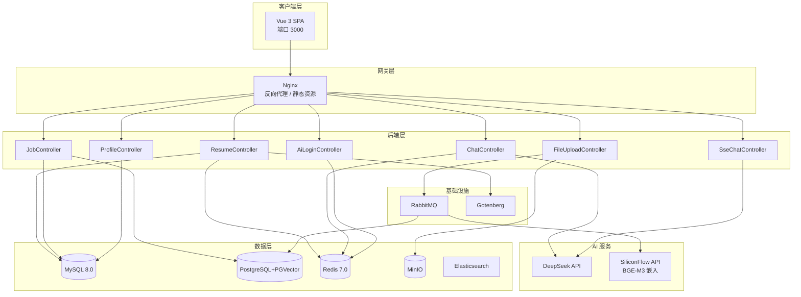

# Resume+ — AI 中文简历诊断平台

<p align="center">
  
</p>
<p align="center">
  <strong>SSE 流式对话 · 向量语义匹配 · Chromium 高保真 PDF · 多场景 AI 面试辅导</strong>
</p>

<p align="center">
  <a href="#"></a>
  <a href="#"></a>
  <a href="#"></a>
  <a href="#"></a>
  <a href="#"></a>
</p>

<p align="center">
  <a href="#核心能力">能力</a> ·
  <a href="#快速开始">快速开始</a> ·
  <a href="#技术栈">技术栈</a> ·
  <a href="#系统架构">架构</a>
</p>

---

## 项目起源

> 投了 30 家公司，没人告诉我简历到底哪里不好。
>
> 市面上的简历工具要么只做英文（对中文排版支持极差），要么只提供一个编辑框。
> 而针对重庆本地互联网岗位的工具，几乎为零。
>
> Resume+ 做的就是**普通人能免费用的、支持任意中文 PDF/Word 上传、还能 AI 诊断和模拟面试的完整工具**。

基于 RuoYi v3.9.2 深度定制，聚焦中文简历解析与 AI 辅助诊断，将 **简历编辑 → AI 诊断 → PDF 导出 → 岗位匹配 → 面试辅导** 串联成完整求职链路。

---

## 核心能力

| | 能力 | 说明 |
|---|------|------|
| 🤖 | **SSE 流式 AI 对话** | 四场景切换（综合 / 简历 / 面试 / 职业规划），首 token < 800ms |
| 📄 | **中文简历智能解析** | 上传 PDF/Word，AI 提取结构化信息，支持任意中文排版 |
| 🩺 | **AI 简历诊断** | 四维评分 + 具体修改建议 + 项目描述润色 + 技能关键词推荐 |
| 🎯 | **向量语义岗位匹配** | PGVector + BGE-M3 嵌入，语义级匹配而非关键词搜索 |
| 💬 | **AI 面试辅导** | 场景化模拟面试，基于简历内容生成面试问题，含点评反馈 |
| 🖨️ | **Chromium 高保真 PDF** | Gotenberg 无头渲染，精确还原 CSS 样式 |
| 🎨 | **水墨主题 UI** | 自定义水墨风格组件，区别于传统 Admin 风格 |

---

## 技术栈

### 后端

| 技术 | 用途 |
|------|------|
| Java 17 + Spring Boot 4.0.3 | 运行时 + 应用框架 |
| Spring Security 6.x + JWT | 认证授权 |
| MyBatis + Druid + PageHelper | 数据访问 |
| DeepSeek API | 大语言模型 |
| PGVector + BGE-M3 | 向量存储与嵌入 |
| Caffeine + Redis | 双层语义缓存 |
| Gotenberg | Chromium PDF 导出 |
| MinIO | 对象存储 |
| Elasticsearch | 全文检索 |
| RabbitMQ | 异步任务队列 |
| PDFBox + Apache POI | 文件解析 |

### 前端

| 技术 | 用途 |
|------|------|
| Vue 3.4 + Vite 5 | 前端框架 + 构建 |
| Element Plus 2.5 | UI 组件库 |
| Pinia + Vue Router 4 | 状态管理 + 路由 |
| TypeScript | 类型安全（渐进式迁移） |
| Axios | HTTP 客户端 |
| html2canvas | PNG 导出 |
| Vitest | 单元测试 |

---

## 系统架构



---

## 快速开始

### 环境要求

| 项目 | 推荐配置 |
|------|---------|
| Docker | 24+ |
| Node.js | 20 LTS |
| JDK | 17+ |
| Maven | 3.9+ |

### 依赖服务

```bash
docker compose up -d mysql redis postgres minio gotenberg
```

### 配置

复制环境变量模板并填入密钥：

```bash
cp .env.example .env
```

### 启动

```bash
# 初始化数据库
mysql -h 127.0.0.1 -u root -p ry_ai < sql/resume_table.sql

# 启动后端
cd ruoyi-backend
mvn clean package -DskipTests
java -jar ruoyi-admin/target/ruoyi-admin.jar

# 启动前端（新终端）
cd ruoyi-front
npm install && npm run dev
```

访问 `http://localhost:3000`，使用 `admin / admin123` 登录。

### 常用命令

```bash
# 后端测试
cd ruoyi-backend && mvn test -pl ruoyi-admin -am -Dtest="FileVectorizationServiceTest,JobAnalyzeServiceTest"

# 前端测试
cd ruoyi-front && npx vitest run
```

---

## 项目结构

```
resume-plus/
├── ruoyi-backend/             # Spring Boot 多模块
│   ├── ruoyi-admin/           # 启动入口 + AI 控制器
│   ├── ruoyi-common/          # 公共工具
│   ├── ruoyi-framework/       # 安全 + 配置
│   ├── ruoyi-system/          # 系统业务
│   ├── ruoyi-generator/       # 代码生成
│   └── ruoyi-quartz/          # 定时任务
│
├── ruoyi-front/               # Vue 3 + Vite + TypeScript
│   └── src/
│       ├── views/             # 页面组件
│       ├── store/             # Pinia 状态管理
│       ├── composables/       # 组合式逻辑
│       ├── api/               # API 模块
│       └── components/        # 可复用组件
│
├── sql/                       # 数据库脚本
├── docs/                      # 文档
├── nginx/                     # Nginx 配置
├── docker-compose.yml         # Docker 编排
└── .env.example               # 环境变量模板
```

---

## CI / CD

Push 到 master 或打开 PR 时自动执行：

- **前端** — `npm install` → `vitest run` → `vite build`
- **后端** — `mvn test`（Service 层单元测试，不依赖外部服务）

---

## 开源 AI 提示词

项目的四组 system prompt（综合助手、简历分析、面试辅导、职业规划）完全公开，见 [docs/AI-PROMPTS.md](./docs/AI-PROMPTS.md)。

---

## 致谢

- [RuoYi](https://ruoyi.vip/) — 优秀的企业级 Java 快速开发框架
- [Gotenberg](https://gotenberg.dev/) — Chromium 无头 PDF 生成服务
- [DeepSeek](https://deepseek.com/) — 高性价比中文大语言模型
- [PGVector](https://github.com/pgvector/pgvector) — PostgreSQL 向量检索扩展
- [Element Plus](https://element-plus.org/) — Vue 3 组件库
- [PoleBrief](https://www.polebrief.com/) — 简历编辑器设计参考

---

## 许可证

MIT License，基于 [RuoYi v3.9.2](https://ruoyi.vip/) 扩展开发。

---

<p align="center">署名 何二娃</p>
