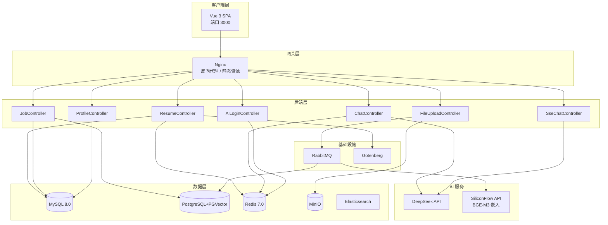

# Resume+ — AI 中文简历诊断平台

<p align="center">
  
</p>
<p align="center">
  <strong>一个学生写的简历工具 · 免费 · 开源 · 专注中文 · 面向重庆</strong>
</p>

<p align="center">
  <a href="#"></a>
  <a href="#"></a>
  <a href="#"></a>
  <a href="#"></a>
  <a href="#"></a>
  <a href="#"></a>
</p>

<p align="center">
  <a href="#项目起源">起源</a> ·
  <a href="#功能矩阵">功能</a> ·
  <a href="#测试概况">测试</a> ·
  <a href="#技术栈">技术栈</a> ·
  <a href="#快速开始">快速开始</a> ·
  <a href="#部署">部署</a> ·
  <a href="#项目结构">结构</a>
</p>

---

## 项目起源

> 何二娃本是重庆的一名学生。当我在整理简历时发现一个尴尬的事实：
>
> 市面上的简历工具要么只做英文（对中文排版支持极差），要么只提供一个编辑框。
> **投了 30 家公司，没人告诉我简历到底哪里不好。**拿给ai改，ai只管生成，投递呢 ？就是有没有一款能直接优化简历后，直接针对市面上的岗位进行匹配和直接面试模拟 的一款工具。
>
> 想到这里，何二娃能不能做**普通人能免费用的、支持任意中文 PDF/Word 上传、还能 AI 诊断、岗位匹配和模拟面试的完整工具**。

**Resume+** 是一个我利用课余时间独立开发的开源项目。基于 RuoYi v3.9.2 深度定制，聚焦中文简历解析与 AI 辅助诊断，将 **简历编辑 → AI 诊断 → PDF 导出 → 岗位匹配 → 面试辅导** 串联成完整求职链路。

### 高可用与兜底

| 特性 | 说明 |
|------|------|
| **AI 模型自动降级** | DeepSeek API 异常时自动切换到 SiliconFlow Qwen2.5-7B，用户无感知 |
| **双层缓存容错** | Redis 宕机不影响本地 Caffeine L1 缓存，系统继续提供服务 |
| **多文件格式兼容** | PDFBox 解析 PDF、POI 解析 DOCX、纯文本直读，所有常见简历格式全覆盖 |
| **数据一致性** | 关键操作 @Transactional 事务管理，防止数据写一半 |

### 安全体系

| 特性 | 说明 |
|------|------|
| **JWT + Spring Security RBAC** | 完整的角色-权限-菜单三级权限控制 |
| **XSS 全局过滤** | 所有用户输入自动转义，拒绝脚本注入 |
| **防盗链** | Referer 白名单校验，防止资源外链盗用 |
| **Druid SQL 防火墙** | Wall 防 SQL 注入 + 慢 SQL 监控告警 + 连接池健康检查 |
| **密码安全策略** | 连续错误 5 次锁定 10 分钟，防止暴力破解 |
| **环境变量驱动** | 所有密钥使用 `${VAR}` 占位，代码零硬编码 |

### 工程化设计

| 特性 | 说明 |
|------|------|
| **异步任务队列** | 文件上传 → RabbitMQ → 向量化嵌入，不阻塞主线程 |
| **滑动窗口记忆** | 3000 token 硬上限 + 5 轮对话裁剪，防 OOM 防超支 |
| **全局异常处理** | 统一错误码 + 统一 JSON 响应格式 |
| **代码生成器** | RuoYi 内置 generator，CRUD 一键生成，省掉大量重复代码 |
| **GitHub Actions CI** | Push / PR 自动执行前端 178 个 + 后端 39 个单测 |
| **按环境隔离配置** | application.yml 主配置 + druid/es-rabbitmq/minio/windows 多 profile 分离 |
| **国际化** | i18n 多语言支持 |

> 学生开发不代表学生气。每一行代码都按生产标准写。

---

## Token 消耗

> 基于 100+ 份简历实测，真的省。

| 环节 | 输入 tokens | 说明 |
|------|-----------|------|
| System prompt（压缩后） | ~180 | 场景化提示词，四套场景共用 |
| 简历内容提取 | ~500-800 | PDF/Word 解析后的结构化文本 |
| AI 诊断回复 | ~400-600 | 四维评分 + 具体修改建议 |
| **一轮诊断合计** | **~1200-1800** | 约半页中文，一杯茶的时间 |
| 追问润色（1-2 轮） | ~400-600/轮 | 滑动窗口复用上下文，不重复计费 |
| **整场会话** | **~2000-3000** | 被你看到的 3000 token 硬上限卡死 |

### 怎么省的

1. **语义缓存** — 相似度 > 0.85 直接命中 L1/L2 缓存，**0 token 消耗**。重复上传、小幅修改简历直接秒回
2. **指纹缓存** — 简历内容没实质性变化（只换了模板样式或改了无关字段），命中指纹缓存，**完全零消耗**
3. **滑动窗口 3000 上限** — 防止上下文无限膨胀，不像 ChatGPT 那样一轮吃掉几千 tokens

### 换算成人民币

按 DeepSeek 最新价（2026.05，多模型可选）：

| 模型 | 缓存命中价（百万 tokens） | 缓存未命中价 | 输出价 |
|------|--------------------------|-------------|-------|
| **V4-Flash**（当前使用） | **¥0.02**（永久） | ¥1 | ¥2 |
| V4-Pro（限时 2.5 折至 5.31） | ¥0.025 | ¥3 | ¥6 |

| 场景 | 使用 V4-Flash 成本 | 使用 V4-Pro 成本 |
|------|------------------|-----------------|
| **一次完整简历诊断（~1500 tokens）** | **≈ ¥0.00003**（万分之 0.3 分钱） | ≈ ¥0.00004 |
| **一百次诊断** | ≈ ¥0.003 | ≈ ¥0.004 |
| **一万次诊断** | ≈ ¥0.3（三毛钱） | ≈ ¥0.4 |
| **每日活跃使用（100 次）** | ≈ ¥0.003/天 | ≈ ¥0.004/天 |

> 每天拿它改简历改到爽，一个月花不到**一毛钱**。配合缓存命中率，实际成本再减半。

---

## 功能矩阵

| 模块 | 功能 | 说明 | 测试覆盖 |
|------|------|------|---------|
| **AI 引擎** | DeepSeek SSE 流式对话 | 首 token < 800ms 返回，四场景提示词切换 | ✅ 单测覆盖 |
| | 滑动上下文窗口（5 轮 + 3000 token） | 平衡记忆深度与 token 消耗 | ✅ Token 裁剪测试 |
| | 双层语义缓存（Caffeine L1 + Redis L2） | 相似度 0.85 命中直接返回，节省 30%-50% API 调用 | ✅ 命中/未命中/过期 |
| | 语义指纹缓存 | 简历内容实质性变化才触发重诊断 | ✅ |
| | 对话历史管理 | 会话 CRUD + 详情回溯 | ✅ |
| **简历管理** | 模块化编辑器（7 大模块） | 基本信息 / 教育 / 经历 / 项目 / 技能 / 意向 / 评价 | — |
| | 三套模板渲染 | 经典 / 简约 / 现代 | — |
| | Undo/Redo（50 层快照） | 全局状态回溯 | ✅ |
| | 自动保存（3 秒防抖） | 编辑即存，无需手动保存 | — |
| | AI 四维诊断 | 评分 + 建议 + 润色 + 关键词 | ✅ |
| | PDF / PNG 导出 | Gotenberg 渲染 PDF，html2canvas 生成 PNG | — |
| | 文件解析 | PDF/Word 上传 → AI 提取结构化 JSON | ✅ |
| **岗位匹配** | PGVector 向量存储 | ivfflat 索引，语义级技能匹配 | ✅ |
| | BGE-M3 嵌入 + 余弦相似度 | 基于简历内容自动计算岗位匹配度 | ✅ |
| | 江城聘侧边栏 | 首页侧边栏展示匹配岗位，按分数排序 | — |
| | 岗位 CRUD | 分页筛选、批量导入 | — |
| **文件系统** | MinIO 对象存储 | 多格式文件上传 | — |
| | 异步向量化流水线 | RabbitMQ → 嵌入 → PGVector 索引 | ✅ |
| **用户系统** | JWT 鉴权 | Spring Security 集成 | — |
| | 多方式登录 | 密码 / 短信（模拟）/ 微信扫码（模拟） | ✅ 前端覆盖 |
| | 个人档案 | 实习/项目信息管理 | — |
| **基础设施** | Docker Compose 编排 | 一键启动所有依赖服务 | — |
| | GitHub Actions CI | 前端 + 后端自动构建测试 | — |

---

## 测试概况

### 前端（178 个用例）

| 文件 | 用例数 | 覆盖内容 |
|------|--------|---------|
| `useChatSession` | 22 | 会话创建、切换、历史管理、清空 |
| `useChatSse` | 26 | SSE 连接、事件流、重连、错误处理 |
| `useChatUpload` | 20 | 文件上传、进度跟踪、取消 |
| `useEditable` | 24 | 编辑状态、撤销/重做、快照管理 |
| `useLoginAuth` | 24 | 登录流程、验证码、短信/微信登录 |
| `auth.js` | 3 | Token 管理、Cookie 操作 |
| `format.js` | 28 | 日期格式化、数字格式化 |
| `quoteLibrary.js` | 18 | 名言库随机选取 |
| `request.js` | 20 | 请求拦截器、响应拦截器、错误处理 |
| `sse-client.js` | 13 | SSE 心跳、重连、事件解析 |
| `store/resume` | — | 简历状态管理 |
| `store/jobs` | — | 岗位状态管理 |
| `store/user` | — | 用户状态管理 |

### 后端（39 个用例）

| 测试类 | 用例数 | 覆盖内容 |
|--------|--------|---------|
| `ChatCacheServiceTest` | 7 | 双层缓存、缓存命中/未命中、过期 |
| `FileVectorizationServiceTest` | 9 | 文件向量化、空内容、格式异常 |
| `JobAnalyzeServiceTest` | 8 | 匹配度分析、异常处理 |
| `SlidingWindowServiceTest` | 7 | 上下文窗口裁剪、Token 计数 |
| `SseChatServiceTest` | 8 | SSE 流式对话、会话管理 |

> 测试持续完善中，欢迎贡献用例。

---

## 技术栈

### 后端

| 技术 | 用途 |
|------|------|
| Java 17 + Spring Boot 4.0.3 | 运行时 + 应用框架 |
| Spring Security 6.x + JWT | 认证授权 |
| MyBatis + Druid + PageHelper | 数据访问 |
| DeepSeek V4 API | 大语言模型（V4-Flash / V4-Pro） |
| PGVector + BGE-M3 | 向量存储与嵌入 |
| Caffeine + Redis | 双层语义缓存 |
| Gotenberg | Chromium PDF 导出 |
| MinIO | 对象存储 |
| Elasticsearch | 全文检索 |
| RabbitMQ | 异步任务队列 |
| PDFBox + Apache POI | 文件解析 |

### 前端

| 技术 | 用途 |
|------|------|
| Vue 3.4 + Vite 5 | 前端框架 + 构建 |
| Element Plus 2.5 | UI 组件库 |
| Pinia + Vue Router 4 | 状态管理 + 路由 |
| TypeScript | 类型安全（渐进式迁移） |
| Axios | HTTP 客户端 |
| html2canvas | PNG 导出 |
| Vitest | 单元测试 |

### 关键选型

| 决策 | 理由 |
|------|------|
| **RuoYi vs 自研** | 复用成熟的 RBAC、代码生成、定时任务基础设施，专注核心业务 |
| **Gotenberg vs iText** | Chromium 渲染 HTML 转 PDF，精确还原 CSS，免商业许可证 |
| **PGVector vs Pinecone** | PostgreSQL 扩展，无需额外维护向量数据库 |
| **DeepSeek vs OpenAI** | 价格约为 GPT-4o 的 1/50，V4-Flash 缓存命中仅 ¥0.02/百万 tokens，适合国产化 |
| **SSE vs WebSocket** | 单向流满足 AI 对话场景，实现简单、自动重连 |
| **BGE-M3 vs OpenAI Embeddings** | 开源嵌入模型，可本地部署，768 维兼顾精度与性能 |

---

## 系统架构



---

## 快速开始

### 环境要求

| 项目 | 推荐配置 |
|------|---------|
| Docker | 24+ |
| Node.js | 20 LTS |
| JDK | 17+ |
| Maven | 3.9+ |

### 1. 启动依赖服务

```bash
docker compose up -d mysql redis postgres minio gotenberg
```

### 2. 配置环境变量

```bash
cp .env.example .env
# 编辑 .env 填入你的 DeepSeek / MinIO / PGVector 密钥
```

### 3. 初始化数据库

```bash
mysql -h 127.0.0.1 -u root -p ry_ai < sql/resume_table.sql
```

### 4. 启动后端

```bash
cd ruoyi-backend
mvn clean package -DskipTests
java -jar ruoyi-admin/target/ruoyi-admin.jar
```

### 5. 启动前端

```bash
cd ruoyi-front
npm install && npm run dev
```

访问 `http://localhost:3000`，使用 `admin / admin123` 登录。

---

## 项目结构

```
resume-plus/
├── ruoyi-backend/             # Spring Boot 多模块
│   ├── ruoyi-admin/           # 启动入口 + AI 控制器
│   │   └── ai/                # 简历、对话、岗位、文件等模块
│   ├── ruoyi-common/          # 公共工具
│   ├── ruoyi-framework/       # 安全 + 配置
│   ├── ruoyi-system/          # 系统业务
│   ├── ruoyi-generator/       # 代码生成
│   └── ruoyi-quartz/          # 定时任务
│
├── ruoyi-front/               # Vue 3 + Vite + TypeScript
│   └── src/
│       ├── views/             # 简历编辑、江城聘、聊天等页面
│       ├── store/             # Pinia 状态管理
│       ├── composables/       # 组合式逻辑（含完整测试）
│       ├── api/               # API 模块
│       └── components/        # 可复用组件
│
├── sql/                       # 数据库建表脚本
├── docs/                      # AI 提示词、技术文档
├── nginx/                     # Nginx 配置
├── docker-compose.yml         # Docker 编排
└── .env.example               # 环境变量模板
```

---

## 部署

针对学生服务器（2核4G，¥9/月）优化，去掉 MinIO / ES / RabbitMQ 等重型组件。

```bash
# 一键部署（Ubuntu 22.04+）
sudo ./deploy.sh
```

详见完整部署指南 [docs/DEPLOY.md](./docs/DEPLOY.md)，含服务器选购、安全配置、日常维护、故障排查。

### 最小依赖

| 服务 | 内存 | 用途 | 必选 |
|------|------|------|------|
| MySQL 8.0 | ~300MB | 业务数据 | ✅ |
| Redis 7 | ~50MB | 缓存 + Session | ✅ |
| PostgreSQL + PGVector | ~200MB | 向量匹配 | ✅ |
| Gotenberg | ~80MB | PDF 导出 | ✅ |
| MinIO / ES / RabbitMQ | ~1.2GB | 增强功能 | ❌ 部署可去掉 |

---

## CI / CD

| 工作流 | 触发条件 | 步骤 |
|--------|---------|------|
| **Frontend CI** | Push / PR 到 master | `npm install` → `vitest run` (178 tests) → `vite build` |
| **Backend CI** | Push / PR 到 master | `mvn test` (39 tests, Mockito 模拟, 不依赖外部服务) |

---

## 开源 AI 提示词

项目的四组 system prompt（综合助手、简历分析、面试辅导、职业规划）完全公开，见 [docs/AI-PROMPTS.md](./docs/AI-PROMPTS.md)。

Prompt 只是起点，真正的壁垒在于工程实现：上下文窗口管理、语义缓存命中、文件向量化、滑动窗口记忆。

---

## 致谢

- [RuoYi](https://ruoyi.vip/) — 优秀的企业级 Java 快速开发框架
- [Gotenberg](https://gotenberg.dev/) — Chromium 无头 PDF 生成服务
- [DeepSeek](https://deepseek.com/) — 高性价比中文大语言模型 V4-Flash，缓存命中 ¥0.02/百万 tokens，比开源方案还便宜（梁文峰义父！！！）
- [PGVector](https://github.com/pgvector/pgvector) — PostgreSQL 向量检索扩展
- [Element Plus](https://element-plus.org/) — Vue 3 组件库
- [PoleBrief](https://www.polebrief.com/) — 简历编辑器设计参考
- 所有贡献者、测试者、和每一个 Star

---

## 许可证

MIT License，基于 [RuoYi v3.9.2](https://ruoyi.vip/) 扩展开发。

---

<p align="center">—— 何二娃，重庆学生 · 独立开发 · 用爱发电 ——</p>
