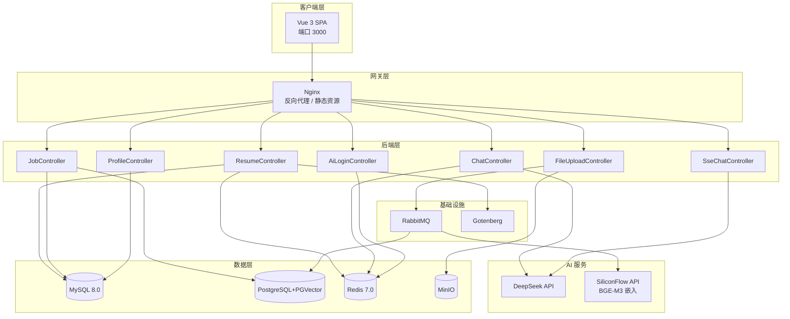

# Resume+ — AI 中文简历诊断平台

<p align="center">
  
</p>

---

## 🎬 演示视频

> 点击下方图片观看完整演示（3 分钟了解全部功能）

<p align="center">
  <a href="https://he2wa.xin/demo-video.html" target="_blank">
    
  </a>
</p>

<p align="center">
  <code style="font-size:18px;background:#f0f0f0;padding:8px 20px;border-radius:6px;">
    👉 <a href="https://he2wa.xin/demo-video.html" target="_blank">https://he2wa.xin/demo-video.html</a>
  </code>
</p>

---

## 🌐 在线体验

<p align="center" style="font-size:20px;padding:16px;background:#e8f4fd;border-radius:10px;border:2px solid #667eea;">
  🔗 <strong><a href="" target="_blank">https://he2wa.xin</a></strong>
</p>


<p align="center">
  <strong>账号：</strong> <code>admin</code> ／ <strong>密码：</strong> <code>admin123</code>
</p>

<p align="center">
  <a href="https://he2wa.xin" target="_blank">
    
  </a>
  <a href="#">
    
  </a>
  <a href="#">
    
  </a>
</p>

---

## 项目起源

> 何二娃本是重庆的一名学生。投了 30 家公司，没人告诉我简历到底哪里不好。
>
> 市面上的简历工具要么只做英文（对中文排版支持极差），要么只提供一个编辑框。
> 拿给 AI 改，AI 只管生成，投递呢？
>
> **有没有一款能直接优化简历后，针对市面上的岗位进行匹配和直接面试模拟的工具？**

**Resume+** 是一个学生利用课余时间独立开发的开源项目。基于 RuoYi v3.9.2 深度定制，聚焦中文简历解析与 AI 辅助诊断，将 **简历编辑 → AI 诊断 → PDF 导出 → 岗位匹配 → 面试辅导 → 投递** 串联成完整求职链路。

> 学生开发不代表学生气。每一行代码都按生产标准写。

---

## 功能矩阵

| 模块 | 功能 | 说明 |
|------|------|------|
| **AI 引擎** | DeepSeek SSE 流式对话 | 首 token < 800ms，四场景提示词切换 |
| | 双模式面试：HR行为面 + 专业面试 | HR面关注软素质/稳定性，专业面按目标岗位动态出题（销售/运营/设计/产品/财务/技术等） |
| | 面试追问逻辑 | 像真实面试官一样连续追问2-3轮挖透话题，非一次性出题 |
| | 滑动上下文窗口（5 轮 + 3000 token） | 平衡记忆深度与 token 消耗 |
| | 双层语义缓存（Caffeine L1 + Redis L2） | 相似度 0.85 命中直接返回 |
| | PDF 排版还原（CoordinateTextStripper） | y坐标排序 + 两栏布局检测，解决PDF左右栏文字交错 |
| | AI 解析结果校验重试 | 自动检查姓名/手机/邮箱/教育/技能等关键字段，缺失时重问 |
| **简历管理** | 模块化编辑器（7 大模块） | 基本信息 / 教育 / 经历 / 项目 / 技能 / 意向 / 评价 |
| | 三套模板渲染 | 经典 / 简约 / 现代 |
| | Undo/Redo（50 层快照） | 全局状态回溯 |
| | AI 四维诊断 | 评分 + 建议 + 润色 + 关键词 |
| | PDF / PNG / Word 导出 | Gotenberg 渲染 PDF，html2canvas 生成 PNG，POI 生成 Word |
| | 文件解析 | PDF/Word 上传 → 排版还原 → AI 提取结构化 JSON → 校验重试 |
| **岗位匹配** | PGVector 向量存储 | ivfflat 索引，语义级技能匹配 |
| | BGE-M3 嵌入 + 余弦相似度 | 基于简历内容自动计算岗位匹配度 |
| | 江城聘侧边栏 | 首页侧边栏展示匹配岗位，按分数排序 |
| **用户系统** | JWT 鉴权 | Spring Security 集成 |
| | 多方式登录 | 密码 / 短信（模拟）/ 微信扫码（模拟） |
| **基础设施** | Docker Compose 编排 | 一键启动所有依赖服务 |
| | GitHub Actions CI | 前端 + 后端自动构建测试 |

---

## 技术栈

### 后端

| 技术 | 用途 |
|------|------|
| Java 17 + Spring Boot 4.0.3 | 运行时 + 应用框架 |
| Spring Security 6.x + JWT | 认证授权 |
| MyBatis + Druid + PageHelper | 数据访问 |
| DeepSeek V4 API | 大语言模型（V4-Flash / V4-Pro） |
| PGVector + BGE-M3 | 向量存储与嵌入 |
| Caffeine + Redis | 双层语义缓存 |
| Gotenberg | Chromium PDF 导出 |
| MinIO | 对象存储 |
| RabbitMQ | 异步任务队列 |
| PDFBox + Apache POI | 文件解析 |

### 前端

| 技术 | 用途 |
|------|------|
| Vue 3.4 + Vite 5 | 前端框架 + 构建 |
| Element Plus 2.5 | UI 组件库 |
| Pinia + Vue Router 4 | 状态管理 + 路由 |
| TypeScript | 类型安全 |
| Axios | HTTP 客户端 |
| html2canvas | PNG 导出 |
| Vitest | 单元测试 |

---

## 系统架构



---

## 安全体系

| 特性 | 说明 |
|------|------|
| **JWT + Spring Security RBAC** | 完整的角色-权限-菜单三级权限控制 |
| **XSS 全局过滤** | 所有用户输入自动转义 |
| **防盗链** | Referer 白名单校验 |
| **Druid SQL 防火墙** | Wall 防 SQL 注入 + 慢 SQL 监控 |
| **密码安全策略** | 连续错误 5 次锁定 10 分钟 |
| **环境变量驱动** | 所有密钥使用 `${VAR}` 占位 |

### 安全审计（实战修复）

| 漏洞 | 风险 | 修复方案 |
|------|------|---------|
| **SSE userId 越权** | 可冒充他人调用 AI 对话 | 改为从 JWT 解析，拒绝客户端参数 |
| **XSS 存储型** | 简历内容可注入 `<script>` | 前端双层过滤 + 白名单模式 |
| **AccessKey 硬编码** | API 密钥泄露即失控 | 全部迁出到 `${}` 占位 |
| **跨域过度开放** | `@CrossOrigin(origins = "*")` | 删除注解，由 Nginx 统一管理 |

---

## Token 消耗

| 环节 | 输入 tokens | 说明 |
|------|-----------|------|
| 简历内容提取 | ~500-800 | PDF/Word 解析后的结构化文本 |
| AI 诊断回复 | ~400-600 | 四维评分 + 具体修改建议 |
| **一轮诊断合计** | **~1200-1800** | 约半页中文 |
| **整场会话** | **~2000-3000** | 被 3000 token 硬上限卡死 |

按 DeepSeek V4-Flash 缓存命中价 **¥0.02/百万 tokens** 计算，一次诊断 ≈ **万分之 0.3 分钱**，每天用到爽一个月花不到一毛钱。

---

## 快速开始

### 环境要求
- Docker 24+
- Node.js 20 LTS
- JDK 17+
- Maven 3.9+

### 启动

```bash
# 1. 启动依赖服务
docker compose up -d mysql redis postgres minio gotenberg

# 2. 配置环境变量
cp .env.example .env
# 编辑 .env 填入你的 DeepSeek / MinIO / PGVector 密钥

# 3. 启动后端
cd ruoyi-backend
mvn clean package -DskipTests
java -jar ruoyi-admin/target/ruoyi-admin.jar

# 4. 启动前端
cd ruoyi-front
npm install && npm run dev
```

访问 `http://localhost:3000`，使用 `admin / admin123` 登录。

---

## 一键部署（学生服务器）

```bash
sudo ./deploy.sh
```

详见 [docs/DEPLOY.md](./docs/DEPLOY.md)。

| 服务 | 内存 | 必选 |
|------|------|------|
| MySQL 8.0 | ~300MB | ✅ |
| Redis 7 | ~50MB | ✅ |
| PostgreSQL + PGVector | ~200MB | ✅ |
| Gotenberg | ~80MB | ✅ |
| MinIO / ES / RabbitMQ | ~1.2GB | ❌ 部署可去掉 |

---

## 项目结构

```
resume-plus/
├── ruoyi-backend/             # Spring Boot 多模块
│   ├── ruoyi-admin/           # 启动入口 + AI 控制器（含PDF坐标提取器 CoordinateTextStripper）
│   ├── ruoyi-common/          # 公共工具
│   ├── ruoyi-framework/       # 安全 + 配置
│   ├── ruoyi-system/          # 系统业务
│   ├── ruoyi-generator/       # 代码生成
│   └── ruoyi-quartz/          # 定时任务
│
├── ruoyi-front/               # Vue 3 + Vite + TypeScript
│   ├── src/views/             # 简历编辑、江城聘、聊天等页面
│   ├── src/store/             # Pinia 状态管理
│   ├── src/composables/       # 组合式逻辑
│   ├── src/api/               # API 模块
│   └── public/                # 静态资源
│       └── demo-video.html    # 演示视频页
│
├── sql/                       # 数据库建表脚本
├── docs/                      # AI 提示词、技术文档
├── nginx/                     # Nginx 配置
└── docker-compose.yml         # Docker 编排
```

---

## 测试

| 模块 | 用例数 | 覆盖内容 |
|------|--------|---------|
| 前端 composables | 178 | SSE、会话管理、上传、编辑、登录 |
| 后端 service | 39 | 缓存、向量化、匹配、滑动窗口、SSE |

---

## 许可证

MIT License，基于 [RuoYi v3.9.2](https://ruoyi.vip/) 扩展开发。

---

<p align="center">
  <a href="https://he2wa.xin" target="_blank"><strong>https://he2wa.xin</strong></a> ·
  <code>admin / admin123</code>
</p>
<p align="center">—— 何二娃，重庆学生 · 独立开发 · 用爱发电 ——</p>
