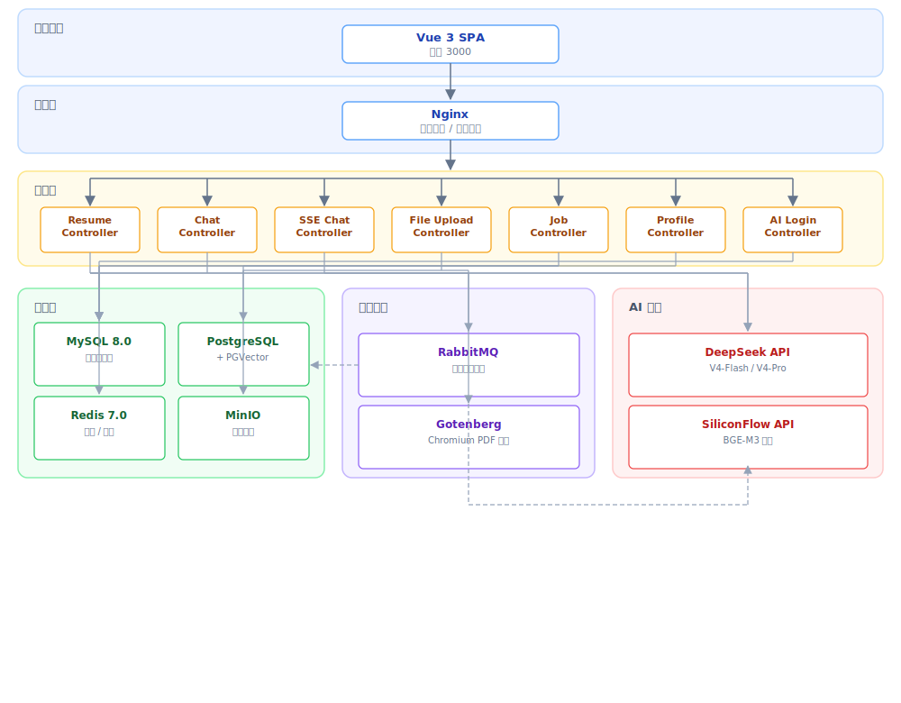

# Resume+ — AI 中文简历诊断平台

<p align="center">
  
</p>

---

## 🎬 演示视频

<p align="center">
  <video src="docs/项目演示.mp4" controls width="100%">
    您的浏览器不支持 video 标签，请<a href="docs/项目演示.mp4">下载视频</a>观看。
  </video>
</p>

---

## 🌐 在线体验

<p align="center" style="font-size:20px;padding:16px;background:#e8f4fd;border-radius:10px;border:2px solid #667eea;">
  🔗 <strong><a href="" target="_blank">https://he2wa.xin</a></strong>
</p>


<p align="center">
  <strong>账号：</strong> <code>admin</code> ／ <strong>密码：</strong> <code>admin123</code>
</p>

<p align="center">
  <a href="https://he2wa.xin" target="_blank">
    
  </a>
  <a href="#">
    
  </a>
  <a href="#">
    
  </a>
</p>

---

## 项目起源

> 何二娃本是重庆的一名学生。何二娃 在一天热的摇裤儿打湿的下午，在哪里改简历。何二娃本来就懒，想到能不能有一个工具。我给它写要求就能直接帮我写简历，帮我匹配市面上适合我的岗位，最后在帮我投递。说白了就是懒！
>

**简历+** 是一个不知名学生利用课余时间独立开发的开源项目。基于 RuoYi v3.9.2 深度定制，聚焦中文简历解析与 AI 辅助诊断，将 **简历编辑 → AI 诊断 → PDF /Word导出 → 岗位匹配 （没想过这么复杂的这个。除了接官方api，只能爬虫实时更新而这个又违法）→ 面试辅导 → 投递** 串联成完整求职链路。

> 作为学生项目，在工程规范上仍有提升空间!! 
>
> 注：本项目在开发过程中使用了 AI 辅助编程工具（Claude Code），但核心业务逻辑架构与系统设计均由人工完成。

---


---

## 功能矩阵

| 模块 | 功能 | 说明 |
|------|------|------|
| **AI 引擎** | DeepSeek SSE 流式对话（做了千文免费模型兜底） | 首 token ≈ 800ms-2s（实测：2核4G学生机，单用户，DeepSeek V4-Flash，网络延迟约30ms。无并发压测，数据为开发环境单次实测） |
| | 双模式面试：HR行为面 + 专业面试 | HR面关注软素质/稳定性，专业面按目标岗位动态出题（销售/运营/设计/产品/财务/技术等） |
| | 面试追问逻辑 | 像真实面试官一样连续追问2-3轮挖透话题，非一次性出题 |
| | 滑动上下文窗口（5 轮 + 3000 token） | 平衡记忆深度与 token 消耗 |
| | 双层缓存（Caffeine L1 + Redis L2） | 关键词前缀匹配（前15字MD5），非语义相似度；阈值为配置预留；无线上命中率数据（学生项目暂无生产流量） |
| | PDF 排版还原（CoordinateTextStripper） | y坐标排序 + 两栏布局检测，解决PDF左右栏文字交错 |
| | AI 解析结果校验重试 | 自动检查姓名/手机/邮箱/教育/技能等关键字段，缺失时重问 |
| **简历管理** | 模块化编辑器（7 大模块） | 基本信息 / 教育 / 经历 / 项目 / 技能 / 意向 / 评价 |
| | 三套模板渲染 | 经典 / 简约 / 现代 |
| | Undo/Redo（50 层快照） | 全局状态回溯 |
| | AI 四维诊断 | 评分 + 建议 + 润色 + 关键词 |
| | PDF / PNG / Word 导出 | Gotenberg 渲染 PDF，html2canvas 生成 PNG，POI 生成 Word |
| | 文件解析 | PDF/Word 上传 → 排版还原 → AI 提取结构化 JSON → 校验重试 |
| **岗位匹配** | PGVector 向量存储 | ivfflat 索引，语义级技能匹配 |
| | BGE-M3 嵌入 + 余弦相似度 | 基于简历内容自动计算岗位匹配度 |
| | 江城聘侧边栏 | 首页侧边栏展示匹配岗位，按分数排序 |
| **用户系统** | JWT 鉴权 | Spring Security 集成 |
| | 多方式登录 | 密码 / 短信（发短信给后端日志\|需要企业资质）/ 微信扫码（模拟\|需要企业资质） |
| **基础设施** | Docker Compose 编排 | 一键启动所有依赖服务 |
| | GitHub Actions CI | 前端 + 后端自动构建测试 |

---

## 设计备忘

### PDF 排版还原：两栏布局检测算法

简历 PDF 最常见的排版是左栏（技能/语言/自我评价）+ 右栏（经历/项目），但 PDFBox 按页面渲染顺序吐出字符，左右栏文字是交错出现的。直接拼接会得到 "技能：Python  2020-2023 后端开发..." 这样的乱序文本。

**方案**：继承 PDFBox 的 `PDFTextStripper`，在字符级别截获坐标，先按 Y 排序恢复行序，再检测两栏布局并重构阅读顺序。

检测两栏的核心判断是：如果超过 20% 的行内部存在大于该行跨度 30% 的空隙，就判定为两栏。这个阈值是用十几份不同排版风格的简历试出来的——低了单栏简历误报，高了窄栏简历漏判。

确定分栏线时，取所有字符 X 坐标的中段 30%（35%~65% 百分位），找最大空隙的中点。避开页边距和偶尔的缩进干扰。

**翻车记录**：
- Mac 和 Windows 上同份 PDF 的行高不一致（字体渲染差异），所以行高不能写死，改为统计相邻字符 Y 差值的众数作为估算行高
- 某些简历左栏只有标签（技能/语言），宽度不足 30px，需要在列检测时跳过这种短行，否则会把标签右侧的空白误判为分栏线
- 字符级排序后，同一单词内的字符可能 Y 坐标有微小抖动（±1px），合并行时用了 70% 行高容差来容忍

完整源码见 `CoordinateTextStripper.java`，约 220 行，没有外部依赖。

### 双层缓存：名字叫"语义"，实际上是关键词前缀匹配

**现状**：配置了 `similarity-threshold: 0.85`，但当前实现是取用户输入的前 15 个字符（去标点）做 MD5 索引，命中直接返回。不是真的向量语义相似度。

**为什么这么做**：要上真语义缓存，需要把用户问题用 BGE-M3 转成向量，存到 PGVector 里做 ANN 检索，每次查询多一次向量推理 + 一次数据库 IO。对于一个每天配额 500 条的学生项目，向量缓存的收益覆盖不了成本——大部分重复提问是同一句话重发（前端重试/用户刷新），前缀匹配已经够了。0.85 的配置是留给将来用户量上来后换真实语义相似度的占位。

**架构**：L1 Caffeine（进程内，1000 条，10 分钟 TTL）+ L2 Redis（分布式，60 分钟 TTL）。命中链是 L1 → L2 → 相似度匹配，L2 命中的条目会回写到 L1。Caffeine 的 `recordStats()` 已开启，REST 接口 `/ai/chat/cache/stats` 可查看命中率，但线上暂无流量所以没数据。

---

## 技术栈

### 后端

| 技术 | 用途 |
|------|------|
| Java 17 + Spring Boot 4.0.3 | 运行时 + 应用框架 |
| Spring Security 6.x + JWT | 认证授权 |
| MyBatis + Druid + PageHelper | 数据访问 |
| DeepSeek V4 API | 大语言模型（V4-Flash / V4-Pro） |
| PGVector + BGE-M3 | 向量存储与嵌入 |
| Caffeine + Redis | 双层语义缓存 |
| Gotenberg | Chromium PDF 导出 |
| MinIO | 对象存储 |
| RabbitMQ | 异步任务队列 |
| PDFBox + Apache POI | 文件解析 |

### 前端

| 技术 | 用途 |
|------|------|
| Vue 3.4 + Vite 5 | 前端框架 + 构建 |
| Element Plus 2.5 | UI 组件库 |
| Pinia + Vue Router 4 | 状态管理 + 路由 |
| TypeScript | 类型安全 |
| Axios | HTTP 客户端 |
| html2canvas | PNG 导出 |
| Vitest | 单元测试 |

---

### 关键选型理由

| 决策                            | 理由                                                      |
| ------------------------------- | --------------------------------------------------------- |
| **RuoYi vs 自研**               | 复用成熟的 RBAC、代码生成、定时任务基础设施，专注核心业务 |
| **Gotenberg vs iText**          | Chromium 渲染 HTML 转 PDF，精确还原 CSS，免商业许可证费用 |
| **PGVector vs Pinecone**        | PostgreSQL 扩展，无需额外维护向量数据库，适合中小规模场景 |
| **DeepSeek vs OpenAI**          | 价格约为 GPT-4 的 1/20，中文理解优秀，适合国产化场景      |
| **SSE vs WebSocket**            | 单向流满足 AI 对话场景，实现简单、自动重连、兼容 HTTP/2   |
| **BGE-M3 vs OpenAI Embeddings** | 开源嵌入模型，可本地部署，768 维向量兼顾精度与性能        |

## 系统架构



---

## 安全体系

| 特性 | 说明 |
|------|------|
| **JWT + Spring Security RBAC** | 完整的角色-权限-菜单三级权限控制 |
| **XSS 全局过滤** | 所有用户输入自动转义 |
| **防盗链** | Referer 白名单校验 |
| **Druid SQL 防火墙** | Wall 防 SQL 注入 + 慢 SQL 监控 |
| **密码安全策略** | 连续错误 5 次锁定 10 分钟 |
| **环境变量驱动** | 所有密钥使用 `${VAR}` 占位（不要把key放到代码里！！！！！） |

### 安全审计（实战修复）

| 漏洞 | 风险 | 修复方案 |
|------|------|---------|
| **SSE userId 越权** | 可冒充他人调用 AI 对话 | 改为从 JWT 解析，拒绝客户端参数 |
| **XSS 存储型** | 简历内容可注入 `<script>` | 前端双层过滤 + 白名单模式 |
| **AccessKey 硬编码** | API 密钥泄露即失控 | 全部迁出到 `${}` 占位 |
| **跨域过度开放** | `@CrossOrigin(origins = "*")` | 删除注解，由 Nginx 统一管理 |

---

## Token 消耗（2核4G学生机，单用户）

| 环节 | 输入 tokens | 说明 |
|------|-----------|------|
| 简历内容提取 | ~500-800 | PDF/Word 解析后的结构化文本 |
| AI 诊断回复 | ~400-600 | 四维评分 + 具体修改建议 |
| **一轮诊断合计** | **~1200-1800** | 约半页中文 |
| **整场会话** | **~2000-3000** | 被 3000 token 硬上限卡死 |

按 DeepSeek V4-Flash 缓存命中价 **¥0.02/百万 tokens** 计算，一次诊断 ≈ **万分之 0.3 分钱**，主播反正是用爽了。

---

## 已知限制

| 限制 | 说明 | 未来计划 |
|------|------|---------|
| **单用户无并发** | 2核4G 学生机，未做并发压测 | 压测后调优连接池 |
| **语义缓存是前缀匹配** | 实际是取前 15 字做 MD5 索引，非向量语义相似度 | 用量上去后换真实向量检索 |
| **PDF 模板仅 3 套** | 现代 / 经典 / 简约 | 社区贡献模板 |
| **面试仅支持中文** | 不可选中英文混合面试 | 多语言面试 |
| **Gotenberg 依赖 Docker** | PDF 渲染依赖 Chromium 容器 | 做前端 jsPDF 兜底 |

---

## 快速开始

### 环境要求
- Docker 24+（可只装 MySQL/Redis，不需要 Docker 全部依赖）
- Node.js 18+（推荐 20 LTS）
- JDK 17+
- Maven 3.8+

### 启动

以下是以本地开发环境（Windows/Linux/Mac）为例的完整启动步骤：

#### 1. 启动依赖服务（Docker）

```bash
# MySQL 8.0（业务数据库）
docker run -d --name mysql -e MYSQL_ROOT_PASSWORD=root -p 3306:3306 mysql:8

# Redis 7（缓存/会话）
docker run -d --name redis -p 6379:6379 redis:7

# PostgreSQL + PGVector（向量检索，如不用岗位匹配可跳过）
docker run -d --name postgres -e POSTGRES_PASSWORD=your-password -p 5433:5432 pgvector/pgvector:pg16

# MinIO（文件存储，可选—上传文件有 Redis 兜底）
docker run -d --name minio -p 9000:9000 -p 9001:9001 minio/minio server /data --console-address ":9001"

# Gotenberg（PDF 导出，可选—前端有 jsPDF 兜底）
docker run -d --name gotenberg -p 3000:3000 gotenberg/gotenberg:8
```

#### 2. 初始化数据库

```bash
# 创建数据库 ry_ai 并导入表结构
mysql -h 127.0.0.1 -u root -p < sql/resume_table.sql
```

#### 3. 配置环境变量

后端通过环境变量读取密钥（Spring Boot `${VAR}` 语法），至少需要配置：

```bash
export DEEPSEEK_API_KEY=sk-your-key
export MYSQL_PASSWORD=root
export JWT_SECRET=$(openssl rand -base64 32)
```

完整变量见下方的 [环境变量参考](#环境变量参考)。Windows 用户推荐直接修改 `restart-back.bat` 填入密钥后双击运行，无需手动 export。

#### 4. 启动后端

```bash
cd ruoyi-backend
mvn spring-boot:run -DskipTests
```

> 首次运行需要下载 Maven 依赖，耗时 2-5 分钟。后端启动后监听 `http://localhost:8080`。

#### 5. 启动前端

```bash
cd ruoyi-front
npm install && npm run dev
```

> npm 下载慢可以换 cnpm：`npm install -g cnpm --registry=https://registry.npmmirror.com && cnpm install`

#### 6. 访问

打开 `http://localhost:3000`，使用 `admin / admin123` 登录。

---

## 环境变量参考

启动前需要配置以下环境变量（推荐用 `.env` 文件或 `restart-back.bat` 管理）：

| 变量 | 用途 | 获取方式 |
|------|------|---------|
| `DEEPSEEK_API_KEY` | DeepSeek 大模型 API | [platform.deepseek.com](https://platform.deepseek.com/) |
| `MINIO_ACCESS_KEY` / `MINIO_SECRET_KEY` | 文件存储 | MinIO 控制台 |
| `PGVECTOR_HOST` / `PGVECTOR_PASSWORD` | 向量数据库 | PostgreSQL 连接信息 |
| `EMBEDDING_API_KEY` | BGE-M3 嵌入服务 | SiliconFlow API |
| `JWT_SECRET` | Token 签名 | 任意随机字符串 |
| `MYSQL_USERNAME` / `MYSQL_PASSWORD` | 业务数据库 | MySQL 凭据 |
| `ALIYUN_SMS_*` | 短信登录（可选） | 阿里云 SMS |
| `WX_APP_SECRET` | 微信扫码（可选） | 微信开放平台 |

> ⚠️ **不要在代码里硬编码密钥！** 现有代码已全部使用 `${VAR}` 占位。

---

## 一键部署（学生服务器）

```bash
sudo ./deploy.sh
```

详见 [docs/DEPLOY.md](./docs/DEPLOY.md)。

| 服务 | 内存 | 必选 |
|------|------|------|
| MySQL 8.0 | ~300MB | ✅ |
| Redis 7 | ~50MB | ✅ |
| PostgreSQL + PGVector | ~200MB | ✅ |
| Gotenberg | ~80MB | ✅ |
| MinIO / ES / RabbitMQ | ~1.2GB | ❌ 部署可去掉 |

---

## 常见问题

<details>
<summary><b>PDF 导出报 500 / Gotenberg 连不上</b></summary>

检查 Gotenberg 是否在运行：`docker ps | grep gotenberg`。如果没启动：`docker run -d -p 3000:3000 gotenberg/gotenberg:8`。配置文件 `application.yml` 里的 `gotenberg.url` 要指向正确的地址（Docker 内用 `http://gotenberg:3000`，本地用 `http://localhost:3000`）。
</details>

<details>
<summary><b>上传文件解析失败 / MinIO 报错</b></summary>

MinIO 没启动或地址不对。启动 MinIO：`docker run -d -p 9000:9000 -p 9001:9001 minio/minio server /data --console-address ":9001"`。重置密码后同步修改 `application.yml` 中的 `minio.access-key` 和 `minio.secret-key`。
</details>

<details>
<summary><b>npm install 太慢 / 报错</b></summary>

用 cnpm：`npm install -g cnpm --registry=https://registry.npmmirror.com && cnpm install`。或者直接配镜像：`npm config set registry https://registry.npmmirror.com`。
</details>

<details>
<summary><b>能跑但不能注册 / 收不到短信</b></summary>
短信功能需要企业资质（阿里云 SMS 审核），学生项目无法通过。可以用 `admin / admin123` 登录，或直接在数据库 `sys_user` 表里手动加账号。
</details>

---

## 项目结构

```
resume-plus/
├── ruoyi-backend/             # Spring Boot 多模块
│   ├── ruoyi-admin/           # 启动入口 + AI 控制器（含PDF坐标提取器 CoordinateTextStripper）
│   ├── ruoyi-common/          # 公共工具
│   ├── ruoyi-framework/       # 安全 + 配置
│   ├── ruoyi-system/          # 系统业务
│   ├── ruoyi-generator/       # 代码生成
│   └── ruoyi-quartz/          # 定时任务
│
├── ruoyi-front/               # Vue 3 + Vite + TypeScript
│   ├── src/views/             # 简历编辑、江城聘、聊天等页面
│   ├── src/store/             # Pinia 状态管理
│   ├── src/composables/       # 组合式逻辑
│   ├── src/api/               # API 模块
│   └── public/                # 静态资源
│       └── demo-video.html    # 演示视频页
│
├── sql/                       # 数据库建表脚本
├── docs/                      # AI 提示词、技术文档
├── nginx/                     # Nginx 配置
└── docker-compose.yml         # Docker 编排
```

---

## 测试

| 模块 | 用例数 | 覆盖内容 |
|------|--------|---------|
| 前端 composables | 178 | SSE、会话管理、上传、编辑、登录 |
| 后端 service | 39 | 缓存、向量化、匹配、滑动窗口、SSE |

---

## 开源 AI 提示词

项目的四组 system prompt（综合助手、简历分析、面试辅导、职业规划）完全公开，见 [docs/AI-PROMPTS.md](./docs/AI-PROMPTS.md)。

Prompt 只是起点，真正的壁垒在于工程实现：上下文窗口管理、语义缓存命中、文件向量化、滑动窗口记忆。如果你有更好的 prompt 设计，欢迎提 PR。

---

## 路线图

- [x] AI 简历诊断 + 描述润色
- [x] 双模式模拟面试（HR面 + 专业面）
- [x] 岗位匹配（PGVector + BGE-M3）
- [x] PDF / Word / PNG 导出
- [ ] **自动投递** — 对接主流招聘平台 API（需要企业资质）
- [ ] **简历模板市场** — 社区贡献更多排版模板
- [ ] **英文简历** — 双语 / 全英文模式
- [ ] **团队协作** — 多用户协同编辑简历
- [ ] **移动端适配** — 小程序 / H5 简历投递

> 画饼不代表能实现，但饼都不画何二娃连起床的动力都没有。

---

## 致谢

这项目就是用一堆开源轮子攒出来的。感谢这些大佬们，让我这个一个学生也能攒出个能跑的东西。

**感谢 DeepSeek**
DeepSeek 的 API 是真的便宜。V4-Flash 缓存命中 ¥0.02/百万 tokens，我算了笔账：一次 AI 诊断 ≈ 万分之 0.3 分钱。于是放心大胆让用户随便问、随便聊，不用心疼 token，当然你也可以直接用**DeepSeek**还不要钱。SSE 流式体验很好，首 token 基本秒回。感谢 DeepSeek 的降价，让我这种屁股比脸干净也能做 AI 应用。

**感谢以下项目（按我用到它们的顺序排）**

- Vue 3 + Vite —— 热更新真的快，改一行代码一秒看到效果
- RuoYi**——好用遭了（儿哄！也有安全隐患哈）
- Element Plus —— 简历编辑器里的 7 大模块，组件基本是拖拖拽拽就出来了
- PDFBox —— 那个 CoordinateTextStripper 我调了两周，但没它真搞不定左右栏交错
- Gotenberg —— PDF 导出一次过，没出过幺蛾子
- GVector + BGE-M3 —— 岗位匹配的核心，向量检索跑起来的那一刻我已经为自己鼓掌了
- Docker —— 依赖一堆服务（MySQL/Redis/PG/MinIO/Gotenberg/RabbitMQ），没有 Docker 我根本部署不明白
- Spring Security —— 虽然学的时候很痛苦，但确实比手写拦截器靠谱一万倍
- [PoleBrief](https://www.polebrief.com/) — 简历编辑器设计参考

**以及**
感谢所有在 GitHub 上把文档写得清清楚楚的开源作者（和我的室友pkj，lmf）。你们随手写的一段 README，可能就救了一个学生的一个通宵。

最后，这个项目 MIT 协议，随便抄。**如果你也是学生觉得这个符合你课题，拿去当课作或者毕业设计没问题**（何二娃同意了！！！点点star义父义妈们）。唯一的请求：如果你改出了更好玩的版本，喊何二娃一声，何二娃高低尝尝咸淡。这里就要引用名人名言了，"***都是同龄人,给我来点酱味大鸡***!"

--何二娃

---

## 贡献指南

**提 Issue**：Bug / 功能建议直接开 issue，附上复现步骤或截图即可。

**提 PR**：
1. Fork 后从 `master` 切功能分支
2. 前后端都通过 `npm run lint` / `mvn verify`
3. PR 标题写清楚改了啥，描述附上前后对比截图（如果有 UI 变更）
4. 统一风格后再合入

代码规范没多严格，何二娃自己写代码也飞叉叉的，但至少别比现有代码乱。

---

## 许可证

MIT License，基于 [RuoYi v3.9.2](https://ruoyi.vip/) 扩展开发。

---

<p align=”center”>——最后很喜欢某音的话”大大方方的丢脸，兴致勃勃去失败，再昂首挺胸重新开始”  ——</p>


